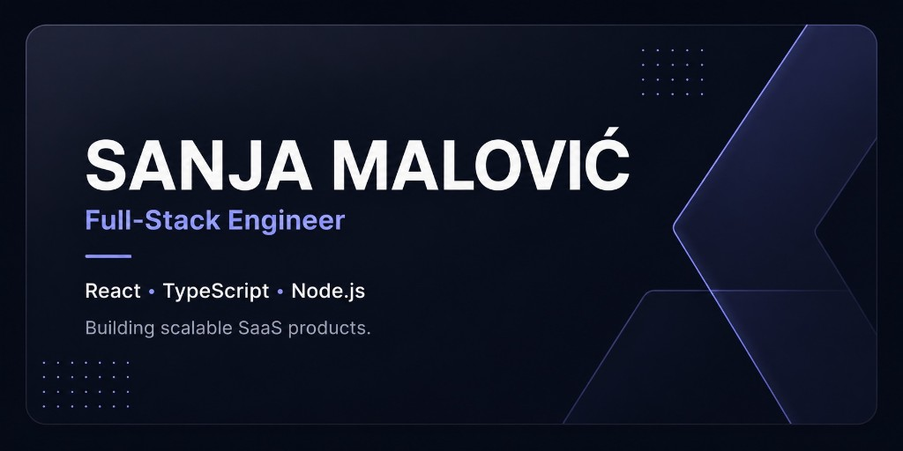

Senior Full-Stack Engineer passionate about building scalable SaaS products, developer tools, and modern web applications.

I have 5+ years of experience building production software across the full stack using React, TypeScript, Node.js, Next.js, NestJS, and PostgreSQL. I enjoy taking products from idea to production, solving complex technical problems, and building software that delivers real value.

---

## 🚀 What I'm working on

### Telemetry Tracker
An open-source observability platform for modern applications.

Features include:
- Error Tracking
- Event Analytics
- Session Tracking
- Multi-tenant Organizations
- API Keys
- Custom SDKs
- Self-hosted & Cloud deployments

🔗 https://telemetry-tracker.tacko.io

---

## 🛠 Tech Stack

### Frontend
- React
- Next.js
- Vue.js
- Nuxt.js
- React Native
- TypeScript
- Tailwind CSS

### Backend
- Node.js
- NestJS
- Fastify
- REST APIs
- GraphQL

### Databases
- PostgreSQL
- Prisma

### Infrastructure
- Docker
- Railway
- Vercel
- Cloudflare
- GitHub Actions

---

## 📌 Featured Projects

### Telemetry Tracker
Open-source observability platform built from scratch featuring custom SDKs, error tracking, analytics, authentication, RBAC, and multi-tenant architecture.

### Growthflicks
Frontend Tech Lead on a production SaaS platform, leading frontend architecture, mentoring engineers, improving performance, and collaborating closely with backend teams.

### FishingPoints
Worked on one of the world's leading fishing platforms, building scalable frontend applications and an SEO platform powering over **30 million** dynamically generated pages.

---

## 🤖 AI-assisted Development

AI is part of my daily engineering workflow.

I regularly use:
- Cursor
- Claude Code
- GitHub Copilot
- ChatGPT

for architecture discussions, implementation, debugging, testing, documentation, and code reviews.

---

## 🌍 Let's connect

🌐 Portfolio  
https://tacko.io

💼 LinkedIn  
https://linkedin.com/in/unjica

📧 Email  
sanja.malovic2@gmail.com
